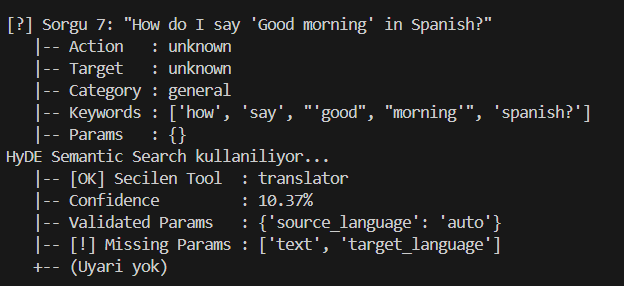
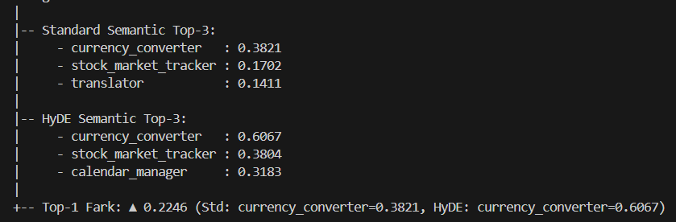
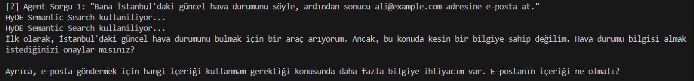

# SelectheBestTool - An Agent Architecture for Tool Selection (simple custom MCP server)

📍 [English](README.md) | [Türkçe](README_tr.md)

## Architecture 

We have 3 main components:

### 1. Main Agent that knows nothing about tools. 
An agent (`gpt-4o-mini` based) that knows nothing about tools beforehand. It uses a meta-tool (`find_and_select_tool`) to declare its intent dynamically, and the system tries to find the appropriate tools for it.

### 2. Tool Registry that stores the tools explanations in JSON format.
Stores the tools explanations in JSON format and schema objects. Automatically discovers tools.

### 3. Tool Selector that makes a bridge between main agent and tool registry.

Acts as a bridge between the main agent and the tool registry. As a user, when you ask something to the main agent, it will use the tool selector to find the best tool by applying filtering and scoring pipeline.

## Other/Sub components

- **Intent Parser:** Parses the user query into keywords, category, action and target.
- **Capability Scorer:** Scores the tools by exact match and partial match (up to keywords that extracted by parser), category match, description of the tool and semantic match (HyDE search or ordinary semantic search). It uses the following base weights:
  - `exact_match`: 1.0
  - `partial_match`: 0.8
  - `category_match`: 0.6
  - `description_match`: 0.4
  - `semantic_match`: 1.0
- **Validate Mechanism:** Beside it checks for type and regex pattern, also hecks query parameters, which is extraced by Parser, with tool parameters. 
- **Fallback Mechanism:** Implements an alternative plan when in the situation of low confidence, the calculation done by Capability Scorer.
- **Semantic Search Mechanism (HyDE):** HyDE produces hypotetical documents from user query by using vector database. By this way the words matching process can be implemented efficiently because the hypotetic documents is a kind of designed query according to the tools descriptions.

## Tools

The framework automatically discovers and registers tools from the `tools/` directory. 
- **Web Search** & **Weather**
- **Database SQL Generators** & **Code Executors**
- **Calendar & Task Managers**
- **File System Tools** (Read/Write/Delete/Search)
- **Translators** & **Currency Converters**
- **AI Image Generators**, **Mailing**, & **Slack Integration**

## Adding a new tool
The ToolAutoLoader facilitates this process. 
In order to add a new tool create a new [tool_name].py file. Fill in file with right tool schema. 

```python
from Tool import ToolSchema, ToolParameter

my_tool = ToolSchema(
    name='my_tool',
    description='Description of the tool',
    category='category_name',
    parameters=[
        ToolParameter(name='param1', type='string', description='...', required=True)
    ],
    returns={'type': 'string', 'description': '...'},
    examples=[{'input': {'param1': 'value'}, 'description': 'Example usage'}],
    capabilities=['keyword1', 'keyword2']
)

TOOL_DEFINITIONS = [my_tool]
```


## File Structure

| File | Description |
|---|---|
| `Tool.py` | The definitions of `ToolSchema`, `ToolParameter` and `ToolRegistry` |
| `ToolAutoLoader.py` | The module that automatically discovers the tools where located in `tools/` directory  |
| `Intent.py` | The extraction of actions, targets and parameters from user query |
| `Score.py` | A scoring engine based on keyword + semantic similarity |
| `SemanticSearch.py` | ChromaDB + OpenAI embedding ile vektörel anlamsal arama |
| `Selector.py` | The main selection orchestrator the connect the main agent with the tool registry |
| `Validate.py` | Parameter type, enum and regex validation |
| `Fallback.py` | Low confidence scenarios and fallback mechanism |
| `main.py` | Demos and Tests |
| `tools/` | The directory where the tools are located |

## Installation

### 1. Clone the repository

```bash
git clone <repository-url>
cd SelectheBestTool
```

### 2. Create a Virtual Environment for isolating your workspace

```bash
python -m venv .venv

# Select the environment
# Windows
.venv\Scripts\activate # if you are in powershell use .venv\Scripts\Activate.ps1

# Linux/Mac
source .venv/bin/activate
```

### 3. Install dependencies

```bash
pip install -r requirements.txt
```

### 4. Set up environment variables

Create a `.env` file in the root directory with the following variables:

```env
OPENAI_API_KEY=your_openai_api_key
```

### 4. Run the application

```bash
python main.py
```

Note: When you run the application, it will automatically discover the tools from the `tools/` directory and register them to the tool registry. The run flow of file is that it will show you the demos of the system without the maint agent first. Then, with no stop or any asking, it will test the main agent with a few examples.


## Issues
The parameter catching mechanism is not good enough. 



**The problem could be possibly about the the Tools definitions, descriptions and examples. If the tools are declared clearly and explicitly, the mechanism will work better.**


## Comparing Standart Semantic vs HyDE

- **The user query:** *"Convert 150 USD to EUR"*

**Standart Semantic Search:**
> It Just send the user query to the vector database. The vector database will return the most similar documents to the user query.

**HyDE:**
> **Hypotetical document to be sent to vector database:** *"CurrencyConverter Pro: A powerful tool that accurately converts currencies in real-time, allowing users to quickly and efficiently exchange USD to EUR and vice versa. Capabilities: real-time conversion, multi-currency support, historical data analysis, user-friendly interface, customizable exchange rates."*

**Result:**



## Main Agent Test/Result



The result and others that I didn't share shows that since the system is a kind of demo, the configuration of Capability Scorer is mandatory. The problem is that when the main agent wants to find the best tool, it checks the score of them. Because the scores is not good enough to select a tool, the responses are turned out to be unrelated or asking for clarification. 

## References

https://oneuptime.com/blog/post/2026-01-30-tool-selection/


