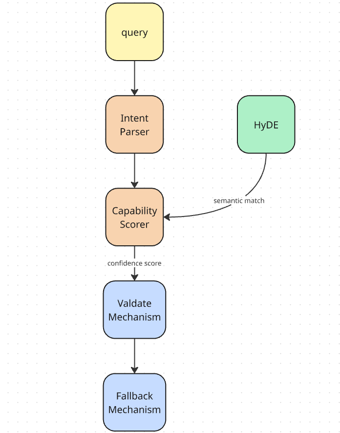

# SelectheBestTool - Araç Seçimi İçin Ajan Mimarisi (basit özel MCP sunucusu)

📍 [English](README.md) | [Türkçe](README_tr.md)

## Mimari 

3 ana bileşenimiz bulunmaktadır:

### 1. Araçlar (tools) hakkında hiçbir şey bilmeyen Ana Ajan. 
Önceden araçlar hakkında hiçbir şey bilmeyen (`gpt-4o-mini` tabanlı) bir ajan. Niyetini (intent) dinamik olarak belirtmek için bir meta-araç (`find_and_select_tool`) kullanır ve sistem onun için uygun araçları bulmaya çalışır.

### 2. Araç açıklamalarını JSON formatında saklayan Araç Kayıt Defteri (Tool Registry).
Araç açıklamalarını JSON formatında ve şema nesnelerinde saklar. Araçları otomatik olarak keşfeder.

### 3. Ana ajan ile araç kayıt defteri arasında köprü kuran Araç Seçici (Tool Selector).

Ana ajan ve araç kayıt defteri arasında bir köprü görevi görür. Bir kullanıcı olarak ana ajana bir şey sorduğunuzda, filtreleme ve puanlama boru hattını (pipeline) uygulayarak en iyi aracı bulmak için araç seçiciyi kullanacaktır.

## Diğer/Alt Bileşenler

- **Intent Parser (Niyet Ayrıştırıcı):** Kullanıcı sorgusunu anahtar kelimelere, kategoriye, eyleme (action) ve hedefe (target) göre ayrıştırır.
- **Capability Scorer (Yetki Puanlayıcı):** Araçları; tam eşleşme (exact match), kısmi eşleşme (partial match) (ayrıştırıcı tarafından çıkarılan anahtar kelimelere kadar), kategori eşleşmesi, araç açıklaması ve anlamsal eşleşme (semantic match - HyDE araması veya normal anlamsal arama) yöntemleriyle puanlar. Şu temel ağırlıkları kullanır:
  - `exact_match`: 1.0
  - `partial_match`: 0.8
  - `category_match`: 0.6
  - `description_match`: 0.4
  - `semantic_match`: 1.0
- **Validate Mechanism (Doğrulama Mekanizması):** Tip ve regex (düzenli ifade) desenlerini kontrol etmesinin yanı sıra, Ayrıştırıcı tarafından elde edilen sorgu parametrelerinin araç parametreleri ile uyumluluğunu da kontrol eder.
- **Fallback Mechanism (Yedek Plan Mekanizması):** Capability Scorer tarafından yapılan hesaplamada düşük güven (low confidence) durumu oluştuğunda alternatif bir plan uygular.
- **Semantic Search Mechanism (HyDE) (Anlamsal Arama Mekanizması):** HyDE, vektör veritabanını kullanarak kullanıcı sorgusundan hipotetik (varsayımsal) belgeler üretir. Hipotetik belgeler araç açıklamalarına göre tasarlanmış bir tür sorgu niteliğinde olduğundan, kelime eşleştirme işlemi bu sayede verimli bir şekilde uygulanabilir.


## Akış




## Araçlar (Tools)

Sistem, araçları `tools/` dizininden otomatik olarak keşfeder ve kaydeder.
- **Web Araması** & **Hava Durumu**
- **Veritabanı SQL Üreticileri** & **Kod Çalıştırıcıları**
- **Takvim & Görev Yöneticileri**
- **Dosya Sistemi Araçları** (Okuma/Yazma/Silme/Arama)
- **Çevirmenler** & **Döviz Çeviriciler**
- **Yapay Zeka Görsel Üreticileri**, **Mail Gönderimi** & **Slack Entegrasyonu**

## Yeni bir araç ekleme
ToolAutoLoader bu süreci kolaylaştırır. 
Yeni bir araç eklemek için yeni bir `[arac_adi].py` dosyası oluşturun. Dosyayı doğru araç şeması (tool schema) ile doldurun.

```python
from Tool import ToolSchema, ToolParameter

my_tool = ToolSchema(
    name='my_tool',
    description='Aracın açıklaması',
    category='kategori_adi',
    parameters=[
        ToolParameter(name='param1', type='string', description='...', required=True)
    ],
    returns={'type': 'string', 'description': '...'},
    examples=[{'input': {'param1': 'value'}, 'description': 'Örnek kullanım'}],
    capabilities=['keyword1', 'keyword2']
)

TOOL_DEFINITIONS = [my_tool]
```


## Dosya Yapısı

| Dosya | Açıklama |
|---|---|
| `Tool.py` | `ToolSchema`, `ToolParameter` ve `ToolRegistry` tanımlamaları |
| `ToolAutoLoader.py` | `tools/` dizininde bulunan araçları otomatik olarak keşfeden modül |
| `Intent.py` | Kullanıcı sorgusundan eylemlerin, hedeflerin ve parametrelerin çıkarılması |
| `Score.py` | Anahtar kelime + anlamsal benzerliğe dayalı puanlama motoru |
| `SemanticSearch.py` | ChromaDB + OpenAI embedding ile vektörel anlamsal arama |
| `Selector.py` | Ana ajan ile araç kayıt defterini birbirine bağlayan ana seçim orkestratörü |
| `Validate.py` | Parametre tipi, enum ve regex doğrulaması |
| `Fallback.py` | Düşük güven senaryoları ve yedekleme (fallback) mekanizması |
| `main.py` | Demolar ve Testler |
| `tools/` | Araçların bulunduğu dizin |

## Kurulum

### 1. Repoyu (depoyu) klonlayın

```bash
git clone https://github.com/UmuT5513/SelectheBestTool-AgentArchitecture
cd SelectheBestTool
```

### 2. Çalışma alanınızı izole etmek için Sanal Ortam (Virtual Environment) oluşturun

```bash
python -m venv .venv

# Ortamı seçin (aktif edin)
# Windows
.venv\Scripts\activate # powershell kullanıyorsanız .venv\Scripts\Activate.ps1 kullanın

# Linux/Mac
source .venv/bin/activate
```

### 3. Bağımlılıkları yükleyin

```bash
pip install -r requirements.txt
```

### 4. Ortam değişkenlerini ayarlayın

Root (kök) dizinde aşağıdaki değişkenlerle birlikte bir `.env` dosyası oluşturun:

```env
OPENAI_API_KEY=sizin_openai_api_anahtariniz
```

### 5. Uygulamayı çalıştırın

```bash
python main.py
```

Not: Uygulamayı çalıştırdığınızda, Sistem `tools/` dizinindeki araçları otomatik olarak keşfedecek ve bunları araç kayıt defterine (tool registry) kaydedecektir. Dosyanın akışı şu şekildedir: İlk olarak ana ajan olmadan sistemin demolarını size gösterecektir. Ardından, birkaç örnekle ana ajanı test edecektir.


## Çıktılar

**Action**, **Target**, **Category**, **Keywords** ve **Params** kullanıcı sorgusundan çıkarılır. Yani, sorgunun öznitelikleridir.  

**Confidence**, Capability Scorer tarafından hesaplanan puandır.

**Validated Params**, Validate Mechanism tarafından doğrulanan parametrelerdir.

**Missing Params**, normalde kullanıcı sorgusundan çıkarılması gereken ancak çıkarılamayan parametrelerdir.

**Warnings**, Validate Mechanism tarafından yapılan uyarılardır.

```text
[?] Sorgu 1: "Convert 150 USD to EUR"
   |-- Action   : unknown
   |-- Target   : unknown
   |-- Category : general
   |-- Keywords : ['convert', '150', 'usd', 'eur']
   |-- Params   : {'number': 150}
HyDE Semantic Search kullaniliyor...
   |-- [OK] Secilen Tool  : currency_converter
   |-- Confidence         : 40.06%
   |-- Validated Params   : {}
   |-- [!] Missing Params : ['amount', 'from_currency', 'to_currency']
   +-- [!] Warnings       : ['Unknown parameter: number']

[?] Fallback Sorgu 1: "Convert 150 USD to EUR"
HyDE Semantic Search kullaniliyor...
   |-- Status              : needs_confirmation
   |-- Requires Confirmation: True
   |-- Secilen Tool        : currency_converter
   |-- Message             : I'm 40% confident you want to use currency_converter. Is this correct?
----------------------------------------------------------------------

[?] Sorgu 2: "Get the current stock price of TSLA"
   |-- Action   : read
   |-- Target   : finance
   |-- Category : finance
   |-- Keywords : ['get', 'current', 'stock', 'price', 'tsla']
   |-- Params   : {}
HyDE Semantic Search kullaniliyor...
   |-- [OK] Secilen Tool  : stock_market_tracker
   |-- Confidence         : 30.61%
   |-- Validated Params   : {'interval': '1d'}
   |-- [!] Missing Params : ['symbol']
   +-- (Uyari yok)

[?] Fallback Sorgu 2: "Get the current stock price of TSLA"
HyDE Semantic Search kullaniliyor...
   |-- Status              : needs_confirmation
   |-- Requires Confirmation: True
   |-- Secilen Tool        : stock_market_tracker
   |-- Params              : {'interval': '1d'}
   |-- Message             : I'm 31% confident you want to use stock_market_tracker. Is this correct?
----------------------------------------------------------------------

[?] Sorgu 3: "Add a new task: Send the weekly report to me about the war news."
   |-- Action   : send
   |-- Target   : productivity
   |-- Category : productivity
   |-- Keywords : ['add', 'new', 'task:', 'send', 'weekly', 'report', 'about', 'war', 'news.']
   |-- Params   : {}
HyDE Semantic Search kullaniliyor...
   |-- [OK] Secilen Tool  : email_sender
   |-- Confidence         : 12.34%
   |-- Validated Params   : {}
   |-- [!] Missing Params : ['to', 'subject', 'body']
   +-- (Uyari yok)

[?] Fallback Sorgu 3: "Add a new task: Send the weekly report to me about the war news."
HyDE Semantic Search kullaniliyor...
   |-- Status              : clarification_needed
   |-- Requires Confirmation: False
   |-- Message             : I need more information to select the right tool.
   |-- Questions:
   |     - What type of operation do you want to perform?
   |     - What data or resource are you working with?
----------------------------------------------------------------------

[?] Sorgu 4: "Bake a chocolate cake for me"
   |-- Action   : unknown
   |-- Target   : unknown
   |-- Category : general
   |-- Keywords : ['bake', 'chocolate', 'cake']
   |-- Params   : {}
HyDE Semantic Search kullaniliyor...
   |-- [OK] Secilen Tool  : timer
   |-- Confidence         : 4.92%
   |-- Validated Params   : {'repeat': False}
   |-- [!] Missing Params : ['message']
   +-- (Uyari yok)

[?] Fallback Sorgu 4: "Bake a chocolate cake for me"
HyDE Semantic Search kullaniliyor...
   |-- Status              : clarification_needed
   |-- Requires Confirmation: False
   |-- Message             : I need more information to select the right tool.
   |-- Questions:
   |     - What type of operation do you want to perform?
   |     - What data or resource are you working with?
----------------------------------------------------------------------

[?] Sorgu 5: "Maybe send an email or a Slack message"
   |-- Action   : send
   |-- Target   : communication
   |-- Category : communication
   |-- Keywords : ['maybe', 'send', 'email', 'slack', 'message']
   |-- Params   : {}
HyDE Semantic Search kullaniliyor...
   |-- [OK] Secilen Tool  : slack_message_sender
   |-- Confidence         : 58.83%
   |-- Validated Params   : {}
   |-- [!] Missing Params : ['channel', 'message']
   +-- (Uyari yok)

[?] Fallback Sorgu 5: "Maybe send an email or a Slack message"
HyDE Semantic Search kullaniliyor...
   |-- Status              : needs_confirmation
   |-- Requires Confirmation: True
   |-- Secilen Tool        : slack_message_sender
   |-- Message             : I'm 59% confident you want to use slack_message_sender. Is this correct?
----------------------------------------------------------------------

[?] Sorgu 6: "Create a query to find the customers in Samsun for marketing"
   |-- Action   : write
   |-- Target   : unknown
   |-- Category : general
   |-- Keywords : ['create', 'query', 'find', 'customers', 'samsun', 'marketing']
   |-- Params   : {}
HyDE Semantic Search kullaniliyor...
   |-- [OK] Secilen Tool  : web_search
   |-- Confidence         : 28.86%
   |-- Validated Params   : {'max_results': 5, 'language': 'tr'}
   |-- [!] Missing Params : ['query']
   +-- (Uyari yok)

[?] Fallback Sorgu 6: "Create a query to find the customers in Samsun for marketing"
HyDE Semantic Search kullaniliyor...
   |-- Status              : clarification_needed
   |-- Requires Confirmation: False
   |-- Message             : I need more information to select the right tool.
   |-- Questions:
   |     - What type of operation do you want to perform?
   |     - What data or resource are you working with?
----------------------------------------------------------------------

[?] Sorgu 7: "How do I say 'Good morning' in Spanish?"
   |-- Action   : unknown
   |-- Target   : unknown
   |-- Category : general
   |-- Keywords : ['how', 'say', "'good", "morning'", 'spanish?']
   |-- Params   : {}
HyDE Semantic Search kullaniliyor...
   |-- [OK] Secilen Tool  : translator
   |-- Confidence         : 6.90%
   |-- Validated Params   : {'source_language': 'auto'}
   |-- [!] Missing Params : ['text', 'target_language']
   +-- (Uyari yok)

[?] Fallback Sorgu 7: "How do I say 'Good morning' in Spanish?"
HyDE Semantic Search kullaniliyor...
   |-- Status              : clarification_needed
   |-- Requires Confirmation: False
   |-- Message             : I need more information to select the right tool.
   |-- Questions:
   |     - What type of operation do you want to perform?
   |     - What data or resource are you working with?
----------------------------------------------------------------------

[?] Sorgu 8: "I need to pull the total revenue from the sales table"
   |-- Action   : unknown
   |-- Target   : database
   |-- Category : data
   |-- Keywords : ['need', 'pull', 'total', 'revenue', 'sales', 'table']
   |-- Params   : {}
HyDE Semantic Search kullaniliyor...
   |-- [OK] Secilen Tool  : database_query
   |-- Confidence         : 23.83%
   |-- Validated Params   : {'database': 'default', 'limit': 100}
   |-- [!] Missing Params : ['query']
   +-- (Uyari yok)

[?] Fallback Sorgu 8: "I need to pull the total revenue from the sales table"
HyDE Semantic Search kullaniliyor...
   |-- Status              : clarification_needed
   |-- Requires Confirmation: False
   |-- Message             : I need more information to select the right tool.
   |-- Questions:
   |     - What type of operation do you want to perform?
   |     - What data or resource are you working with?
----------------------------------------------------------------------

[OK] Tum testler (pipeline + fallback) tamamlandi.
```


## Sorunlar (Issues)
Parametre yakalama mekanizması yeterince iyi çalışmıyor.


**Sorun muhtemelen Araç tanımlarıyla, açıklamalarıyla ve örnekleriyle ilgili. Eğer araçlar net ve belirgin bir şekilde tanımlanırsa, mekanizma daha iyi çalışacaktır.**


## Standart Anlamsal (Semantic) Arama ile HyDE'ın Karşılaştırılması

- **Kullanıcı sorgusu:** *"150 USD'yi EUR'ya çevir"*

**Standart Anlamsal Arama:**
> Sadece kullanıcı sorgusunu vektör veritabanına gönderir. Vektör veritabanı, kullanıcı sorgusuna en çok benzeyen belgeleri döndürür.

**HyDE:**
> **Bir LLM ile kullanıcı sorgusundan üretilen hipotetik belgeleri/belgeyi vektör tabanına gönderir. Bu noktada ilgili sorguya göre oluşturulan ve gönderilecek olan belge:** *"CurrencyConverter Pro: Para birimlerini gerçek zamanlı olarak isabetli bir şekilde çeviren, kullanıcıların USD'yi EUR'ya ve tam tersine hızlı ve verimli bir şekilde dönüştürmesini sağlayan güçlü bir araç. Yetenekler: gerçek zamanlı dönüştürme, çoklu para birimi desteği, geçmiş veri analizi, kullanıcı dostu arayüz, özelleştirilebilir döviz kurları."*

**Sonuç:**


## Ana Ajan'ın Kullanımı (Use of Main Agent)


Aldığım diğer sonuçlar ve buradaki sonuç şunu gösteriyor ki, sistem bir tür demo olduğu için Capability Scorer (Yetki Puanlayıcı) konfigürasyonu hayati önem taşımaktadır. Sorun şu ki, ana ajan en iyi aracı bulmak istediğinde araçların puanını kontrol ediyor. Puanlar bir aracı seçmek için yeterince iyi olmadığından, yanıtlar alakasız sonuçlar veriyor veya daha fazla detay istenmesine yol açıyor.

## Referanslar

https://oneuptime.com/blog/post/2026-01-30-tool-selection/
